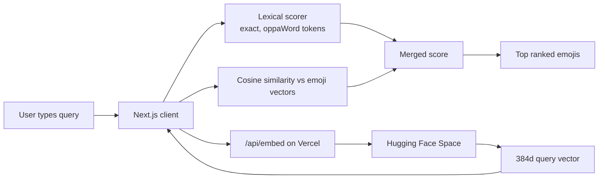
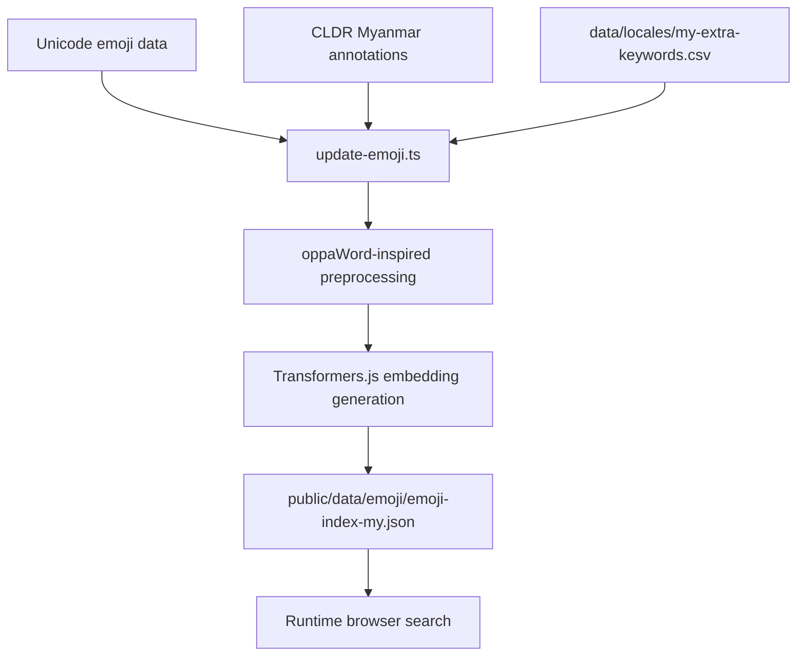

# Burmese Emoji Search


A Burmese and English emoji search experience that blends oppaWord-inspired Burmese word matching with multilingual semantic vector search. The app keeps ranking in the browser for instant results while delegating query embedding generation to a lightweight backend proxy and a Hugging Face Space.

Developed by **Heinko**.

## Overview

This project helps Myanmar-language users find emojis by exact meaning, Burmese word matches, and semantic intent without depending mainly on syllable overlap.

For a deeper system walkthrough, see [search_architecture.md](/Users/heink/v0-burmese-emoji-search-su/search_architecture.md).

## Features

- Hybrid search that combines oppaWord-inspired Burmese word matching with multilingual semantic embeddings
- Client-side ranking against a precomputed emoji vector index for fast response time
- Query embeddings generated by a Hugging Face Space instead of a heavy Vercel serverless function
- Unicode and CLDR-based data pipeline with CLDR metadata plus a small contributed-keyword layer

## Architecture

At runtime, the browser keeps the emoji dataset in memory, calls `/api/embed` for the current query embedding, and then scores everything locally.



The data pipeline is separate from the runtime path:



## Runtime Components

1. `public/data/emoji/emoji-index-my.json` stores emoji metadata, Burmese `wordTokens`, Burmese `searchTextMy`, and precomputed 384-dimensional vectors.
2. `hooks/use-semantic-search.ts` computes lexical scores from oppaWord-derived tokens and boosted contributed keywords, then asks `/api/embed` for multi-view query embeddings when semantic mode is enabled.
3. `app/api/embed/route.ts` is a small proxy route that forwards embedding requests to the public Hugging Face Space.
4. `hf-space-embed-service/` contains the Docker-based Space service that loads `intfloat/multilingual-e5-small`.

## Updating Emoji Data

To rebuild the Burmese emoji index:

```bash
npm run update-emoji
```

The generated files in `public/data/emoji/` are intentionally not tracked in git, so run this after cloning or whenever the search data changes.

That script will:

1. Download Unicode emoji definitions
2. Download CLDR Myanmar annotations
3. Merge extra contributor keywords from `data/locales/my-extra-keywords.csv`
4. Generate oppaWord-style Burmese tokens and Burmese search text
5. Generate embeddings for each emoji entry
6. Write the final JSON index into `public/data/emoji/`

## Hugging Face Space

The embedding service source lives in `hf-space-embed-service/`. It is designed for a Docker-based Hugging Face Space and exposes:

- `GET /health`
- `GET /embed?q=...`

By default, the app uses the deployed public Space URL baked into `/api/embed`. You can override it later with `EMBEDDING_SERVICE_URL` if needed.

## Contributing Burmese Keywords

If you want to improve Burmese search, add slang or hand-curated keywords to [data/locales/my-extra-keywords.csv](/Users/heink/v0-burmese-emoji-search-su/data/locales/my-extra-keywords.csv).

- `Hex`: the emoji code points from Unicode emoji data
- `Emoji`: the emoji character, for readability
- `Extra Keywords`: comma-separated Burmese or slang keywords to add on top of CLDR

CLDR still supplies the emoji list, Burmese names, and base annotations. This file is only for carefully contributed extra search terms, and those terms receive a ranking boost.

## Tech Stack

- Next.js 15 App Router
- React 19
- Transformers.js
- Hugging Face Spaces
- Tailwind CSS and shadcn/ui
- `sylbreak` Burmese syllable fallback
- oppaWord-inspired Burmese word segmentation

## References

Implemented sources:

- [oppaWord](https://github.com/ye-kyaw-thu/oppaWord)
- [sylbreak](https://github.com/ye-kyaw-thu/sylbreak)
- [Multilingual E5 model card](https://huggingface.co/intfloat/multilingual-e5-small)
- [Multilingual E5 technical report](https://arxiv.org/abs/2402.05672)

Reviewed but not integrated:

- [myWord](https://github.com/ye-kyaw-thu/myWord)
- [NgaPi](https://github.com/ye-kyaw-thu/NgaPi)

## License

MIT
