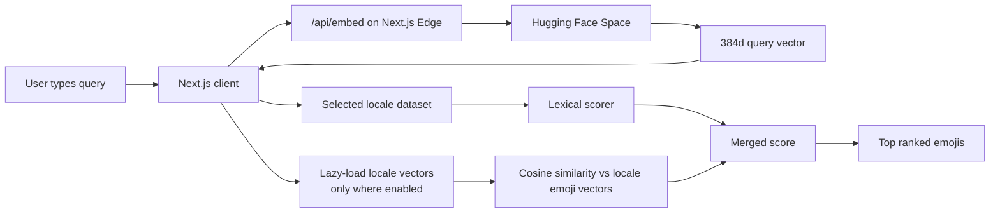
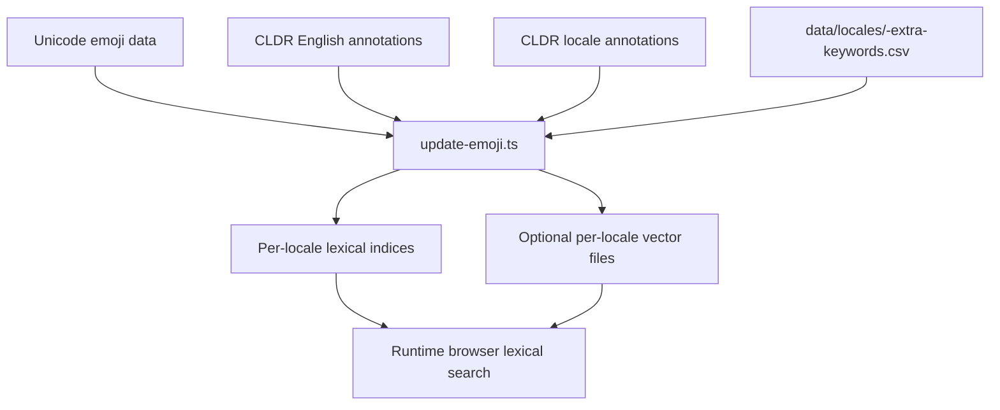

# Myanmar Emoji Search


A locale-aware emoji search experience for Burmese, Shan, and English. The app keeps lexical ranking in the browser, always merges English keywords into every supported locale, and lazily adds multilingual semantic search for locales that enable it.

Developed by **Heinko**.

## Overview

This project helps Myanmar-region users find emojis with natural language instead of depending on official Unicode emoji names.

Current supported locales:

- Burmese (`my`)
- Shan (`shn`)
- English (`en`)

Current search behavior:

- every locale can search with English keywords as a built-in fallback
- Burmese keeps the strongest locale-specific matching path with syllable-aware concept recovery
- Shan and English use the generic locale path
- semantic search is currently enabled for Burmese and English

For detailed technical documentation, see the [docs/](./docs/) folder covering [search architecture](./docs/search-architecture.md), [search scoring](./docs/search-scoring.md), and [Burmese segmentation](./docs/burmese-segmentation-review.md).

## Features

- Locale selector with supported languages only
- Hybrid lexical plus semantic search
- Per-locale emoji datasets generated from CLDR annotations
- English keyword support merged into every locale dataset
- Locale-specific contributor keyword files
- Client-side ranking with lazy-loaded semantic vectors
- Semantic mode available for Burmese and English, with Shan staying lexical-only
- Remote query embeddings via `/api/embed` and a Hugging Face Space

## Architecture

At runtime, the browser always loads the lexical emoji dataset for the selected locale. When the selected locale supports semantic mode and the user turns it on, the client lazily fetches the matching vector index and calls `/api/embed` for weighted query-view embeddings.



The offline data pipeline is separate:



## Runtime Components

1. `lib/locale-config.ts` is the source of truth for supported locales, placeholders, examples, and semantic availability.
2. `public/data/emoji/emoji-index-<locale>.json` stores lexical runtime data for each locale.
3. `public/data/emoji/emoji-vectors-<locale>.json` stores precomputed vectors only for locales with semantic mode enabled.
4. `lib/emoji-data.ts` loads and caches locale-specific datasets and embeddings.
5. `hooks/use-semantic-search.ts` debounces search, lazily hydrates semantic datasets, and caches query embeddings by locale and query view.
6. `lib/search-ranking.ts` handles Burmese query analysis, generic token scoring, semantic boosting, cohort boosting, and skin-tone collapsing.
7. `app/api/embed/route.ts` is an Edge route that proxies query embedding requests to the Hugging Face Space.
8. `hf-space-embed-service/` contains the Docker-based Space service that loads `intfloat/multilingual-e5-small`.

## Updating Emoji Data

To rebuild all supported locale indices:

```bash
npm run update-emoji
```

That command is incremental by default:

- it regenerates lexical metadata for every supported locale
- it only re-embeds rows whose semantic embedding input changed for semantic-enabled locales
- it writes a shared manifest at `public/data/emoji/emoji-build-manifest.json`

To force a full rebuild of semantic embeddings:

```bash
npm run update-emoji:full
```

The build currently emits:

- `public/data/emoji/emoji-index-my.json`
- `public/data/emoji/emoji-index-shn.json`
- `public/data/emoji/emoji-index-en.json`
- `public/data/emoji/emoji-vectors-my.json`
- `public/data/emoji/emoji-vectors-en.json`
- `public/data/emoji/emoji-build-manifest.json`

Commit regenerated files in `public/data/emoji/` after rebuilding so deploys stay in sync.

## Contributor Keywords

Locale-specific extra keywords live in:

- [data/locales/my-extra-keywords.csv](./data/locales/my-extra-keywords.csv)
- future locales can add files like `data/locales/shn-extra-keywords.csv`

File shape:

- `Hex`: emoji code points
- `Emoji`: emoji character for readability
- `English Name`: reference label
- `Extra Keywords`: comma-separated locale terms

These files add carefully curated search terms on top of CLDR annotations. English fallback is already baked into every locale dataset separately.

If contributors need a lookup list for `Hex` and `Emoji`, run `npm run update-emoji` and use `data/dist/emoji-contributor-catalog.csv`. This catalog is generated from fully-qualified Unicode emoji entries and is not tracked in git.

## Supported and Planned Locales

Supported now:

- Burmese
- Shan
- English

Planned later, only when emoji annotation data is confirmed:

- Pali
- Mon
- S'gaw Karen
- Pwo Karen
- Jingpho (Kachin)
- Rakhine
- Pa'O
- Chin (Falam)
- Chin (Tedim)

## Tech Stack

- Next.js 15 App Router
- React 19
- Transformers.js for build-time embedding generation
- Hugging Face Spaces
- Tailwind CSS and shadcn/ui
- `sylbreak` plus lexicon-backed Burmese concept recovery

## References

Implemented sources:

- [sylbreak](https://github.com/ye-kyaw-thu/sylbreak)
- [Multilingual E5 model card](https://huggingface.co/intfloat/multilingual-e5-small)
- [Multilingual E5 technical report](https://arxiv.org/abs/2402.05672)
- [CLDR repository](https://github.com/unicode-org/cldr)

Reviewed but not directly implemented sources:

- [myWord](https://github.com/ye-kyaw-thu/myWord)
- [NgaPi](https://github.com/ye-kyaw-thu/NgaPi)
- [oppaWord](https://github.com/ye-kyaw-thu/oppaWord)

## License

MIT. See [LICENSE](./LICENSE).

Third-party datasets, model weights, and referenced upstream resources keep their
own licenses and terms. See [THIRD_PARTY_NOTICES.md](./THIRD_PARTY_NOTICES.md)
for a source and notices summary.
