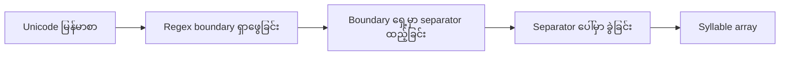
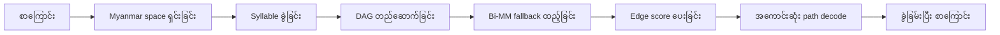
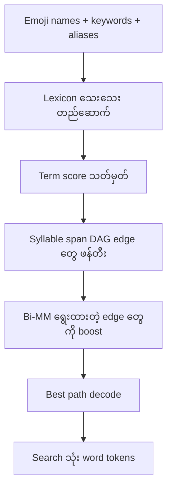
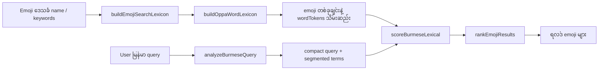

# မြန်မာစာ Segmentation သုံးသပ်ချက်

> 📖 [Read in English](./burmese-segmentation-review.md)

ဒီစာရွက်စာတမ်းက မူရင်း `sylbreak` နဲ့ `oppaWord` project တွေကို ဒီ repo ထဲမှာ သုံးထားတဲ့ implementation တွေနဲ့ နှိုင်းယှဉ်ပြထားပါတယ်။ ဘာတွေကို တိုက်ရိုက်ယူသုံးထားတယ်၊ ဘာတွေကို ပြင်ဆင်ထားတယ်၊ ဘာကြောင့် emoji ရှာဖွေရေးအတွက် general-purpose segmenter ထက် ဒီလိုပြင်ဆင်ထားတာ ပိုကောင်းတယ်ဆိုတာ ရှင်းပြထားပါတယ်။

## သုံးသပ်ခဲ့သော အရင်းအမြစ်များ

- မူရင်း `sylbreak` repository: <https://github.com/ye-kyaw-thu/sylbreak>
- မူရင်း `oppaWord` repository: <https://github.com/ye-kyaw-thu/oppaWord>
- ဒီ repo ရဲ့ implementation: [lib/sylbreak.ts](../lib/sylbreak.ts)
- ဒီ repo ရဲ့ implementation: [lib/oppa-word.ts](../lib/oppa-word.ts)
- ရှာဖွေရေး integration: [lib/burmese-search.ts](../lib/burmese-search.ts)
- အဆင့်သတ်မှတ်ရေး integration: [lib/search-ranking.ts](../lib/search-ranking.ts)

သုံးသပ်ချိန်မှာ upstream repo တွေရဲ့ commit head များ:

- `sylbreak`: `8b9cc076a3c0c4e22bef27c6fa1849dcd9bff41c`
- `oppaWord`: `4c31ecae2977207949635b90d8b923ef29c1d000`

## အကျဉ်းချုပ်

ဒီ repo ထဲက `sylbreak` က upstream TypeScript implementation နဲ့ အတော်လေး တူပါတယ်။ ရှာဖွေရေးအတွက် wrapper တွေ ထပ်ထည့်ထားရုံပါပဲ။

ဒီ repo ထဲက `oppaWord` ကတော့ တိုက်ရိုက် port လုပ်ထားတာ မဟုတ်ပါဘူး။ upstream ရဲ့ architecture ကို အခြေခံပြီး emoji ရှာဖွေရေးအတွက် အထူးပြင်ဆင်ထားတဲ့ adaptation ဖြစ်ပါတယ်:

- syllable-first preprocessing ကို ဆက်သုံးပါတယ်
- forward/backward maximum matching ကို ဆက်သုံးပါတယ်
- DAG နဲ့ dynamic-programming decode ကို ဆက်သုံးပါတယ်
- external dictionary, syllable frequency table, language model, CLI, post-edit rule pipeline တွေကို ဖယ်ရှားထားပါတယ်
- emoji names နဲ့ keywords တွေကနေ တည်ဆောက်ထားတဲ့ lexicon သေးသေးလေးနဲ့ အစားထိုးထားပါတယ်

ဒါကြောင့် ဒီ repo ရဲ့ `oppaWord` ကို မူရင်း segmenter ရဲ့ ပုံတူကူးချ (reproduction) အနေနဲ့ မဟုတ်ဘဲ ရှာဖွေရေးအတွက် intent-preserving adaptation အနေနဲ့ ဖတ်သင့်ပါတယ်။

## နှိုင်းယှဉ်ဇယား

| နယ်ပယ် | မူရင်း `sylbreak` | ဒီ repo ရဲ့ `sylbreak` | မူရင်း `oppaWord` | ဒီ repo ရဲ့ `oppaWord` |
|---|---|---|---|---|
| အဓိကရည်ရွယ်ချက် | အဝဏ္ဏ (syllable) ခွဲခြားခြင်း | ရှာဖွေရေးအတွက် syllable ခွဲခြားခြင်း | မြန်မာစာ စကားလုံးခွဲခြားခြင်း (general) | Emoji ရှာဖွေရေးအတွက် tokenization |
| နည်းပညာအဓိက | Regex boundary rule တစ်ခုတည်း | Upstream TS နဲ့ အတူတူ regex | DAG + Bi-MM + LM hybrid | DAG + Bi-MM-inspired scoring + app lexicon |
| Input mode | CLI / library | Library သီးသန့် | CLI batch segmenter | Library သီးသန့် |
| Dictionary | မသုံးဘူး | မသုံးဘူး | External word dictionary | Emoji names, keywords, aliases ကနေ ဆောက်ထားတာ |
| LM / frequency | မသုံးဘူး | မသုံးဘူး | Syllable frequency + ARPA / KenLM | မသုံးဘူး |
| Search integration | မရှိဘူး | ရှိတယ် | မရှိဘူး | ရှိတယ် |

## အပိုင်း ၁: `sylbreak`

### မူရင်းက ဘာလုပ်တာလဲ

မူရင်း `sylbreak` က တမင် ရိုးရှင်းအောင် ဒီဇိုင်းလုပ်ထားတာပါ — syllable အသစ်စတဲ့ စာလုံးရှေ့မှာ separator ထည့်ပေးတာပဲ ဖြစ်ပါတယ်။

အဓိက rule က:

1. Myanmar ဗျည်း၊ Latin ဂဏန်း/အက္ခရာ၊ နဲ့ အခြား standalone စာလုံးတွေကို သတ်မှတ်ပါ
2. Syllable အသစ်စနိုင်တဲ့ နေရာတွေကို ရှာဖွေပါ
3. အဲ့ဒီနေရာတွေရှေ့မှာ separator ထည့်ပါ
4. Separator ပေါ်မှာ string ကို ခွဲပါ



ဘာသာဗေဒအရ အရေးကြီးတဲ့ အချက်က:

- ဗျည်းတစ်လုံးသည် subscript continuation အဖြစ် မဆောင်ရွက်မှသာ syllable အသစ်ကို စသင့်ပါတယ်
- `်` (အသတ်) သို့မဟုတ် `္` (ကင်းစီး) နောက်မှာ ရှိတဲ့ ဗျည်းသည် syllable အသစ်မစသင့်ပါ

#### ဥပမာ: `sylbreak` syllable ခွဲခြင်း

| Input | Output | ရှင်းလင်းချက် |
|---|---|---|
| `မင်္ဂလာပါ` | `["မင်္", "ဂ", "လာ", "ပါ"]` | ကင်းစီးနောက်က `ဂ` ကို သီးခြား syllable အဖြစ် ခွဲထားတယ် |
| `ကြောင်` | `["ကြောင်"]` | ဗျည်းတွဲနဲ့ သရ ပါဝင်တဲ့ syllable တစ်ခုတည်း |
| `နှလုံးသား` | `["နှ", "လုံး", "သား"]` | syllable ၃ ခုအဖြစ် ခွဲထားတယ် |
| `ခုနစ်ရက်` | `["ခု", "နစ်", "ရက်"]` | syllable ၃ ခု၊ တစ်ခုစီမှာ အသတ်ပါတယ် |
| `hello` | `["hello"]` | Latin စာလုံးကို ခွဲမထုတ်ဘဲ ထားတယ် |
| `emoji😀ရှာ` | `["emoji😀", "ရှာ"]` | Myanmar မဟုတ်တာနဲ့ Myanmar ကို ခွဲထားတယ် |

### ဒီ repo မှာ ဘာတွေဆက်ထားတယ်

[lib/sylbreak.ts](../lib/sylbreak.ts) ရဲ့ အပေါ်ပိုင်းက upstream TypeScript port ကို အတိအကျ ကူးယူထားတာပါ:

- character class တွေ အတူတူ
- export ထားတဲ့ `MYANMAR_SYLLABLE_BREAK_PATTERN` အတူတူ
- `Sylbreak.segment` အတူတူ
- `Sylbreak.segmentWithSeparator` အတူတူ

### ဒီ repo မှာ ထပ်ထည့်ထားတဲ့ Search helper များ

ရှာဖွေရေးအတွက် helper ၂ ခု ထပ်ထည့်ထားပါတယ်:

1. `sylbreak(text)`
   - zero-width character တွေ ဖယ်ရှားပါတယ်
   - input အလွတ်ဆိုရင် `[]` ပြန်ပေးပါတယ်
   - output piece တစ်ခုချင်းကို trim လုပ်ပါတယ်
   - empty string တွေ ဖယ်ချပါတယ်
   - segmentation result မရှိရင် `[text]` ပြန်ပေးပါတယ်

2. `normalizeBurmese(text)`
   - `sylbreak` ကို အရင်ခေါ်ပါတယ်
   - syllable တွေကို space နဲ့ ပေါင်းပါတယ်
   - search layer အတွက် normalized surface form ပေးပါတယ်

#### ဥပမာ: `normalizeBurmese` လုပ်ဆောင်ပုံ

```
Input:  "နှလုံးသား"
sylbreak → ["နှ", "လုံး", "သား"]
normalizeBurmese → "နှ လုံး သား"
```

```
Input:  "အပြုံးမျက်နှာ"
sylbreak → ["အ", "ပြုံး", "မျက်", "နှာ"]
normalizeBurmese → "အ ပြုံး မျက် နှာ"
```

### အရေးကြီးတဲ့ အသေးစိတ်: upstream Python နဲ့ TypeScript မတူတဲ့ နေရာ

ဒီ repo ရဲ့ `sylbreak` က upstream **TypeScript** port ကို လိုက်ထားတာဖြစ်ပြီး upstream **Python** implementation နဲ့ တချို့ string တွေမှာ ကွာခြားမှု ရှိနိုင်ပါတယ်။

ဥပမာ:

| Implementation | Input | Output |
|---|---|---|
| Upstream Python `sylbreak.py` | `မင်္ဂလာပါ` | `မင်္ဂ\|လာ\|ပါ` |
| Upstream TypeScript `sylbreak.ts` | `မင်္ဂလာပါ` | `["မင်္", "ဂ", "လာ", "ပါ"]` |
| ဒီ repo ရဲ့ `lib/sylbreak.ts` | `မင်္ဂလာပါ` | `["မင်္", "ဂ", "လာ", "ပါ"]` |

ဆိုလိုတာက ဒီ code က upstream TS port ကို faithful ဖြစ်ပါတယ်။ ဒါပေမယ့် upstream repo ထဲက implementation variant အားလုံးနဲ့ တူတာ မဟုတ်ပါဘူး။

### ဒီ app အတွက် ဘာကြောင့် `sylbreak` လုံလောက်တယ်ဆိုတာ

Emoji ရှာဖွေရေးအတွက် syllable segmentation က building block ဖြစ်ပါတယ်၊ နောက်ဆုံးထုတ်ကုန် မဟုတ်ပါဘူး။ ကျွန်တော်တို့ အဓိက လိုအပ်တာက:

- တည်ငြိမ်တဲ့ syllable chunk တွေ
- မြန်မာစာအတွက် compact normalization
- word-level segmenter အတွက် ရိုးရှင်းတဲ့ base layer

ဒါကြောင့် lightweight `sylbreak` wrapper က ကောင်းကောင်းကိုက်ညီပါတယ်။

## အပိုင်း ၂: `oppaWord`

### မူရင်းက ဘာလုပ်တာလဲ

Upstream `oppaWord` က syllable splitter ရိုးရိုးမဟုတ်ပါ ── တကယ့် word segmenter ဖြစ်ပါတယ်။

သူ့ pipeline က:

1. Myanmar space ရှင်းလင်းခြင်း (optional)
2. Input စာကြောင်းကို syllable တွေအဖြစ် ပြောင်းခြင်း
3. အများဆုံး syllable length အထိ candidate word span တွေနဲ့ DAG တည်ဆောက်ခြင်း
4. Candidate တစ်ခုချင်းကို score ပေးခြင်း:
   - dictionary membership
   - syllable frequency
   - language model score
   - Bi-MM boost (optional)
5. Bi-directional Maximum Matching fallback path ထည့်ခြင်း
6. Dynamic programming / Viterbi-style decoding နဲ့ အကောင်းဆုံး path ရှာခြင်း
7. Post-edit rule တွေ apply လုပ်ခြင်း (optional)



### ဒီ repo မှာ ဘာတွေဆက်ထားတယ်

[lib/oppa-word.ts](../lib/oppa-word.ts) က architecture ရဲ့ ပုံသဏ္ဌာန်ကို ထိန်းထားပြီး အများကြီး ချုံ့ထားပါတယ်:

- Myanmar-aware normalization
- Myanmar-space compaction (digit ကာကွယ်ခြင်းနဲ့)
- `sylbreak` ကို သုံးပြီး syllable-first segmentation
- Forward maximum matching
- Backward maximum matching
- Candidate word span DAG
- Dynamic-programming best path ရွေးချယ်ခြင်း

### ဘာတွေ ဖယ်ရှားထားတယ်

Browser-side emoji ရှာဖွေရေးအတွက် မကိုက်ညီတဲ့ အပိုင်းတွေကို တမင်ဖယ်ရှားထားပါတယ်:

- External CLI ❌
- File-based dictionary loading ❌
- Syllable frequency file ❌
- ARPA / KenLM language model ❌
- Post-edit rules file ❌
- DAG PDF export ❌
- Batch sentence processing pipeline ❌

ဒါတွေက မူရင်း segmenter မှာ အင်အားကြီးပါတယ်၊ ဒါပေမယ့် ဒီ app အတွက် အလေးချိန်၊ ရှုပ်ထွေးမှု၊ runtime cost ထပ်ပိုသွားစေပါတယ်။

### ဘာတွေနဲ့ အစားထိုးထားတယ်

ကြီးမားတဲ့ general-purpose dictionary နဲ့ LM အစား emoji search data ကနေ lightweight lexicon တစ်ခု တည်ဆောက်ပါတယ်:

- ဒေသခံ emoji အမည်များ
- ဒေသခံ keywords များ
- `wordTokens` များ

ဒါက [lib/burmese-search.ts](../lib/burmese-search.ts) ထဲမှာ `OppaWordLexicon` တစ်ခုအနေနဲ့ emoji dataset ကနေ တည်ဆောက်ပါတယ်။

ဒါကြောင့် ဒီ segmenter က:

- ❌ "မြန်မာစာ စာကြောင်းတိုင်းအတွက် အကောင်းဆုံး segmentation ဘာလဲ" ကို ဖြေဖို့ မဟုတ်ပါ
- ✅ "ဒီ မြန်မာ query က မှန်ကန်တဲ့ emoji concept ကို ဘယ်လို ကိုက်ညီအောင် tokenize လုပ်ရမလဲ" ကို ဖြေဖို့ ဖြစ်ပါတယ်

### ဒီ repo ရဲ့ Scoring နည်းဗျူဟာ

Upstream `oppaWord` က dictionary, frequency, language model evidence တွေ ရောနှောပြီး score ပေးပါတယ်။

ဒီ repo ရဲ့ `oppaWord` ကတော့ search-oriented heuristic scoring ကို သုံးပါတယ်:

- Emoji data ထဲမှာ ထပ်ခါထပ်ခါ ပေါ်တဲ့ lexicon term တွေ ― score ပိုရ
- Multi-syllable term ရှည်ရှည်တွေ ― score ပိုရ
- Bi-MM ကလည်း ရွေးထားတဲ့ edge တွေ ― bonus ရ
- မသိတဲ့ single-syllable fallback တွေ ― penalty ရ



## လက်တွေ့ ကွာခြားမှုများ

### ကွာခြားမှု ၁: ဒီ repo ရဲ့ `oppaWord` က concept-lexicon driven ဖြစ်တယ်

#### ဥပမာ: "အပြုံးမျက်နှာ" segmentation

| Segmenter | Input | Output | ရှင်းလင်းချက် |
|---|---|---|---|
| Upstream `oppaWord` | `အပြုံးမျက်နှာ` | `အပြုံး မျက်နှာ` | ဘာသာဗေဒအရ စာလုံး ၂ လုံးအဖြစ် ခွဲတယ် |
| ဒီ repo ရဲ့ `oppaWord` | `အပြုံးမျက်နှာ` | `["အပြုံးမျက်နှာ"]` | Emoji lexicon ထဲမှာ phrase လုံးလုံး ရှိတဲ့အတွက် မခွဲဘဲ ထားတယ် |

**ဘာကြောင့်ဒီလိုဖြစ်တာလဲ:**

- Upstream က ဘာသာဗေဒအရ ခိုင်လုံတဲ့ word segmentation ထုတ်ဖို့ ကြိုးစားတယ်
- ဒီ repo ရဲ့ code က dataset ထဲမှာ တန်ဖိုးမြင့်တဲ့ emoji concept ကို ထိန်းသိမ်းဖို့ ကြိုးစားတယ်

Emoji ရှာဖွေရေးအတွက်ဆိုရင် `အပြုံးမျက်နှာ` ကို search concept တစ်ခုတည်းအဖြစ် ထားတာ ပိုကောင်းပါတယ်။

#### ဥပမာ ထပ်ခံ: emoji search term ခွဲခြင်း

| Input query | ဒီ repo ရဲ့ segmentation | ရှင်းလင်းချက် |
|---|---|---|
| `နှလုံးသား` | `["နှလုံးသား"]` | Emoji name "နှလုံးသား ❤️" နဲ့ lexicon ထဲမှာ ကိုက်ညီတယ် |
| `ကြောင်မျက်နှာ` | `["ကြောင်", "မျက်နှာ"]` | phrase လုံးလုံး lexicon ထဲမှာ မရှိလို့ term ၂ ခုအဖြစ် ခွဲတယ် |
| `အိမ်` | `["အိမ်"]` | Lexicon ထဲမှာ ရှိတဲ့ term တစ်ခုတည်း |
| `မီးသတ်ကား` | `["မီးသတ်ကား"]` | Emoji concept term အဖြစ် lexicon ထဲမှာ ရှိရင် မခွဲဘဲ ထားတယ် |

### ကွာခြားမှု ၂: ဒီ repo ရဲ့ `oppaWord` က probabilistic dependency အကြီးစားတွေ ရှောင်ရှားတယ်

Upstream သုံးနိုင်တာ:
- Dictionary
- Syllable frequency
- ARPA / KenLM language model
- Post-edit rules

ဒီ repo ရဲ့ code က ဒီ external resource တွေ တစ်ခုမှ မသုံးပါဘူး။ ဒါကြောင့် browser-side search system:

- ✅ Ship လုပ်ရ ပိုလွယ်တယ်
- ✅ Emoji data ကနေ rebuild လုပ်ရ ပိုလွယ်တယ်
- ✅ Deterministic ဖြစ်အောင် ထိန်းရ ပိုလွယ်တယ်

Tradeoff ကတော့ မူရင်းထက် scope ကျဉ်းသွားတာပါပဲ။

### ကွာခြားမှု ၃: ဒီ repo ရဲ့ `oppaWord` က query-centric ဖြစ်တယ်

Upstream project က စာကြောင်းခွဲခြားခြင်း (sentence segmentation) အတွက် တည်ဆောက်ထားတာ ဖြစ်ပါတယ်။

ဒီ repo ရဲ့ implementation ကတော့ ရှာဖွေရေး query တိုတိုတွေအတွက် tune လုပ်ထားပါတယ်:

- emoji names (ဥပမာ: `နှလုံးသား`)
- query aliases (ဥပမာ: `ချစ်တယ်`)
- partial concept phrases (ဥပမာ: `ပျော်ရွှင်`)

ဒါကြောင့် surrounding code က ဒါတွေကို အဓိကထားပါတယ်:

- `compactQuery` ― query ကို ကျစ်ကျစ်လစ်လစ် ဖြစ်အောင်လုပ်ခြင်း
- `segmentedTerms` ― ခွဲခြမ်းထားတဲ့ term တွေ
- `wordTokens` ― emoji တစ်ခုချင်းရဲ့ word token တွေ
- ranking boosts from token support ― token ကိုက်ညီမှု bonus

စာကြောင်းအဆင့် output format ကို ဦးစားမပေးပါ။

## End-to-End Integration

ဒီ repo ထဲက မြန်မာစာ ရှာဖွေရေး လမ်းကြောင်း:



#### ဥပမာ: End-to-end ရှာဖွေရေး flow

**Data build အဆင့်:**
```
Emoji: 😊
ဒေသခံ name: "အပြုံးမျက်နှာ"
Keywords: ["ပျော်ရွှင်", "ပြုံး", "ချစ်စရာ"]
↓ buildOppaWordLexicon
wordTokens: ["အပြုံးမျက်နှာ", "ပျော်ရွှင်", "ပြုံး", "ချစ်စရာ"]
```

**Search အဆင့်:**
```
User query: "ပြုံးနေတဲ့မျက်နှာ"
↓ analyzeBurmeseQuery
compactQuery: "ပြုံးနေတဲ့မျက်နှာ"
segmentedTerms: ["ပြုံး", "နေ", "တဲ့", "မျက်နှာ"]
↓ scoreBurmeseLexical
"ပြုံး" → wordTokens ထဲမှာ ကိုက်ညီ ✅
"မျက်နှာ" → name substring ထဲမှာ ကိုက်ညီ ✅
↓ rankEmojiResults
😊 score: lexical + semantic → ရလဒ်ထဲ ပါ
```

ဒါကြောင့်ပဲ ဒီ repo ရဲ့ implementation က upstream `oppaWord` နဲ့ ကွဲပျား ── segmenter က ranking system ရဲ့ အစိတ်အပိုင်းတစ်ခုသာ ဖြစ်ပါတယ်။

## ပိုင်းခြားလေ့လာ: ဒီ repo ရဲ့ နည်းလမ်း vs မူရင်း

### ဒီ repo ရဲ့ နည်းလမ်း အားသာတဲ့ နေရာ

- ✅ Browser-friendly ― external file တွေ မလိုဘူး
- ✅ Deterministic ― input တူရင် output အမြဲတူတယ်
- ✅ Emoji vocabulary နဲ့ တိတိကျကျ ကိုက်ညီတယ်
- ✅ Dataset ကနေ ပြန်ဆောက်ရ လွယ်တယ်
- ✅ Lexicon ထဲမှာ ရှိတဲ့ emoji concept တွေ ထိန်းသိမ်းထားတယ်

### Upstream `oppaWord` ပိုအားကောင်းတဲ့ နေရာ

- General-purpose မြန်မာ word segmentation
- Dictionary ကြီးကြီးတွေနဲ့ tune လုပ်လို့ရတယ်
- Syllable frequency နဲ့ language model သုံးလို့ရတယ်
- Post-edit repair rule support ရှိတယ်
- DAG visualization ထုတ်လို့ရတယ်

ဒါကြောင့် ဒီ repo ရဲ့ version ကို:

- ✅ **product-tuned search tokenizer** အဖြစ် ဖော်ပြသင့်ပါတယ်

ဒီလို မဖော်ပြသင့်ပါ:

- ❌ **upstream `oppaWord` ရဲ့ အစားထိုး** (full replacement)

## အကြံပြုချက်များ

### ဒီအတိုင်း ဆက်ထားသင့်တာ

- ✅ Emoji ရှာဖွေရေးအတွက် ဒီ repo ရဲ့ `oppaWord` ကို ဆက်သုံးပါ
- ✅ Base syllable layer အဖြစ် ဒီ repo ရဲ့ `sylbreak` ကို ဆက်သုံးပါ

### ရှင်းလင်းစွာ မှတ်တမ်းတင်ထားသင့်တာ

Code comment နဲ့ docs ထဲမှာ ဒါတွေ ရှင်းရှင်းလင်းလင်း ရေးထားသင့်ပါတယ်:

- ဒီ repo ရဲ့ `sylbreak` က upstream TypeScript port ကို follow လုပ်ထားတယ်
- ဒီ repo ရဲ့ `oppaWord` က upstream-inspired ဖြစ်ပြီး faithful port မဟုတ်ဘူး
- ဒီ segmenter က concept retrieval အတွက် optimize လုပ်ထားတာ ── corpus-grade benchmark အတွက် မဟုတ်ဘူး

### အနာဂတ် upgrade ရွေးချယ်မှုများ

နောက်ပိုင်း မြန်မာစာ ရှာဖွေရေး ပိုကောင်းအောင် လုပ်ချင်ရင် အဆင်ပြေဆုံး incremental improvement တွေက:

1. Emoji နဲ့ ခံစားချက်ဘာသာစကားအတွက် curated မြန်မာ concept dictionary ထည့်ခြင်း
2. တကယ့် user query တွေကနေ segmentation miss တွေကို log ယူပြီး လေ့လာခြင်း
3. အသုံးများတဲ့ ရှာဖွေရေး phrase တွေအတွက် post-edit rule layer သေးသေး ထည့်ခြင်း (optional)
4. Lexicon work နဲ့ recall ပြဿနာ မဖြေရှင်းနိုင်မှသာ LM-backed approach ကို စဉ်းစားခြင်း

## နိဂုံး

ဒီ repo ထဲက `sylbreak` က upstream နဲ့ နီးနီးကပ်ကပ် တူပါတယ်၊ search normalization အတွက် အသုံးဝင်တဲ့ wrapper တွေ ထပ်ထည့်ထားပါတယ်။

ဒီ repo ထဲက `oppaWord` က upstream ရဲ့ architectural idea တွေကို ထိန်းသိမ်းထားပြီး scoring data၊ runtime model၊ output goal ကို တမင်ပြောင်းလဲထားပါတယ်။ ရလဒ်က generic မြန်မာစာ word segmenter မဟုတ်ပါ ── ပိုသေးငယ်ပြီး ပိုမြန်ပြီး emoji ရှာဖွေရေးအတွက် domain-adapted tokenizer ဖြစ်ပါတယ်။ ဒါက ဒီ app အတွက် တိတိကျကျ လိုအပ်တဲ့ အရာပါပဲ။
