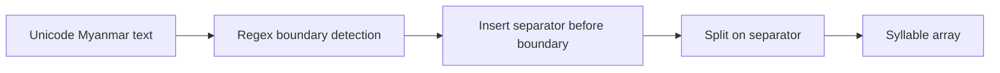
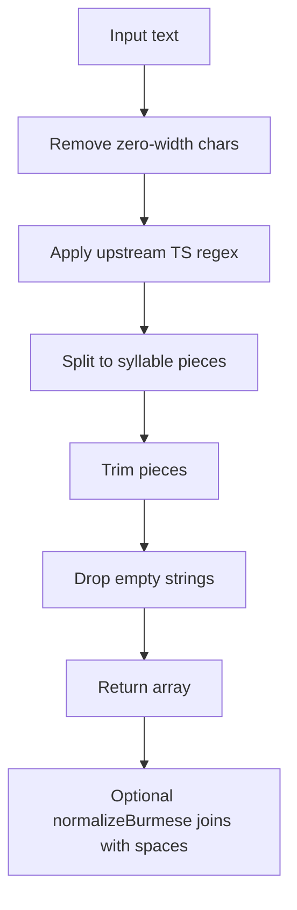
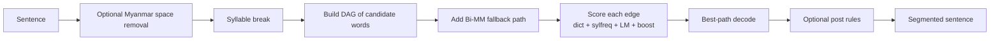
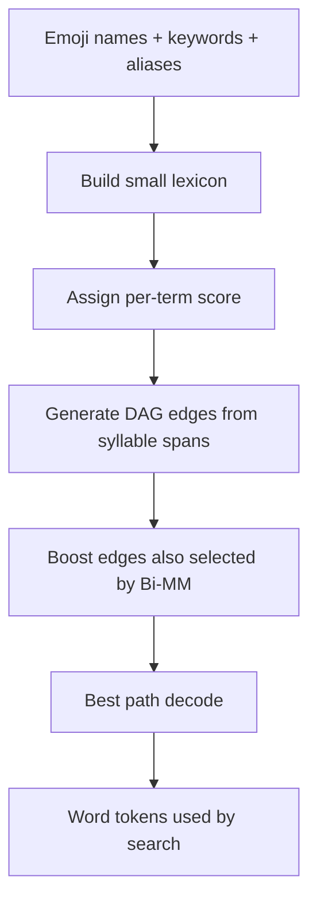
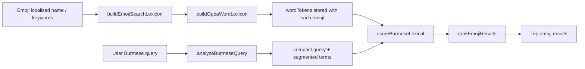

# Burmese Segmentation Review

> 📖 [မြန်မာဘာသာဖြင့် ဖတ်ရန်](./burmese-segmentation-review-my.md)

This document compares the original `sylbreak` and `oppaWord` projects with the implementations used in this repo. The goal is to make it clear what we copied directly, what we adapted, and why the adapted behavior fits emoji search better than a full general-purpose segmenter.

## Sources Reviewed

- Upstream `sylbreak` repository: <https://github.com/ye-kyaw-thu/sylbreak>
- Upstream `oppaWord` repository: <https://github.com/ye-kyaw-thu/oppaWord>
- Local implementation: [lib/sylbreak.ts](/Users/heink/v0-burmese-emoji-search-su/lib/sylbreak.ts)
- Local implementation: [lib/oppa-word.ts](/Users/heink/v0-burmese-emoji-search-su/lib/oppa-word.ts)
- Search integration: [lib/burmese-search.ts](/Users/heink/v0-burmese-emoji-search-su/lib/burmese-search.ts)
- Ranking integration: [lib/search-ranking.ts](/Users/heink/v0-burmese-emoji-search-su/lib/search-ranking.ts)

The upstream repos were reviewed from these heads during this comparison:

- `sylbreak`: `8b9cc076a3c0c4e22bef27c6fa1849dcd9bff41c`
- `oppaWord`: `4c31ecae2977207949635b90d8b923ef29c1d000`

## Executive Summary

`sylbreak` in this repo is very close to the upstream TypeScript implementation. We mostly added search-oriented wrappers on top of it.

`oppaWord` in this repo is not a direct port. It is an in-app, emoji-search-specific adaptation inspired by the upstream architecture:

- we keep the syllable-first preprocessing idea
- we keep forward/backward maximum matching
- we keep a DAG plus dynamic-programming decode
- we remove the external dictionary, syllable frequency table, language model, CLI, and post-edit rule pipeline
- we replace them with a small lexicon built from emoji names and keywords

So the local `oppaWord` should be read as an intent-preserving search adaptation, not as a full reproduction of the original segmenter.

## Comparison Table

| Area | Upstream `sylbreak` | Local `sylbreak` | Upstream `oppaWord` | Local `oppaWord` |
|---|---|---|---|---|
| Main purpose | Syllable segmentation | Syllable segmentation for search normalization | General Myanmar word segmentation | Search-time tokenization for Burmese emoji lookup |
| Core technique | Single regex boundary rule | Same regex core as upstream TS version | Hybrid DAG + Bi-MM + LM | Hybrid DAG + Bi-MM-inspired scoring with in-app lexicon |
| Input mode | CLI / library variants | Library only | CLI batch segmenter | Library only |
| Dictionary | None | None | External word dictionary | Built from emoji names, keywords, aliases |
| LM / frequency | None | None | Optional syllable frequency + ARPA / KenLM | None |
| Post rules | None in core algorithm | None | Supported | None |
| Visualization | Regex figure in repo | Mermaid doc below | DAG PDF export in repo | Mermaid doc below |
| Search integration | No | Yes | No | Yes |

## Part 1: `sylbreak`

### What the original does

The original `sylbreak` is intentionally minimal: it inserts a separator before characters that look like syllable starts.

At a high level, the rule says:

1. Define Myanmar consonants, Latin digits/letters, and a bucket of other standalone characters.
2. Detect positions where a new syllable can begin.
3. Insert a separator before each such position.
4. Split the string on that separator.

Conceptually:

The important linguistic idea in the upstream README is:

- a consonant should start a new syllable only when it is not acting like a subscript continuation
- the same consonant should not start a new syllable when followed by `်` or `္`

### What our implementation keeps

The top half of [lib/sylbreak.ts](/Users/heink/v0-burmese-emoji-search-su/lib/sylbreak.ts) is effectively a copy of the upstream TypeScript port:

- same character classes
- same exported `MYANMAR_SYLLABLE_BREAK_PATTERN`
- same `Sylbreak.segment`
- same `Sylbreak.segmentWithSeparator`

### What we added locally

We added two search-specific helpers:

1. `sylbreak(text)`
   - removes zero-width characters
   - returns `[]` for empty input
   - trims each output piece
   - drops empty pieces
   - falls back to `[text]` when segmentation returns nothing

2. `normalizeBurmese(text)`
   - runs `sylbreak`
   - joins the syllables with spaces
   - gives the search layer a normalized surface form

These additions are useful for indexing and matching because search code wants clean arrays and stable space-separated text, not a CLI-style separator stream.

### Important subtlety: upstream Python and upstream TypeScript are not identical

This is the one detail worth calling out explicitly.

Our local `sylbreak` matches the upstream **TypeScript** port, but the newer upstream **Python** implementation behaves differently for some strings.

Example:

- Upstream Python `sylbreak.py` on `မင်္ဂလာပါ` produced: `မင်္ဂ|လာ|ပါ`
- Upstream TypeScript `sylbreak.ts` produced: `["မင်္","ဂ","လာ","ပါ"]`
- Our local `lib/sylbreak.ts` produced: `["မင်္","ဂ","လာ","ပါ"]`

That means our code is faithful to the upstream TS port, but not to every implementation variant inside the upstream repo.

### Step-by-step local `sylbreak` flow

### Why this is enough for our app

For emoji search, syllable segmentation is a building block, not the final product. We mainly need:

- stable syllable chunks
- compact normalization for Burmese text
- a simple base layer for our word-level segmenter

That makes the lightweight `sylbreak` wrapper a good fit.

## Part 2: `oppaWord`

### What the original does

The upstream `oppaWord` is a real word segmenter, not just a syllable splitter.

Its pipeline is roughly:

1. Optional Myanmar-space cleanup.
2. Convert the input sentence into syllables.
3. Build a DAG of all candidate word spans up to a max syllable length.
4. Score each candidate with:
   - dictionary membership
   - syllable frequency
   - language model score
   - optional Bi-MM boost
5. Add a Bi-directional Maximum Matching fallback path.
6. Use dynamic programming / Viterbi-style decoding to find the best path.
7. Apply optional post-edit rules.
8. Optionally emit DAG visualizations.

Conceptually:

Upstream scoring is therefore feature-rich and corpus-informed.

### What our implementation keeps

The local [lib/oppa-word.ts](/Users/heink/v0-burmese-emoji-search-su/lib/oppa-word.ts) keeps the architecture shape, but trims it down heavily:

- Myanmar-aware normalization
- Myanmar-space compaction with digit protection
- syllable-first segmentation using `sylbreak`
- forward maximum matching
- backward maximum matching
- a DAG of candidate word spans
- dynamic-programming selection of the best path

That means the skeleton of the algorithm is recognizably inspired by upstream `oppaWord`.

### What we removed

We intentionally removed the parts that do not fit a browser-side emoji search stack:

- no external CLI
- no file-based dictionary loading
- no syllable frequency file
- no ARPA or KenLM language model
- no post-edit rules file
- no DAG PDF export
- no batch sentence processing pipeline

These are powerful in the original segmenter, but they would add weight, complexity, and runtime cost that our app does not need.

### What we replaced them with

Instead of a large general-purpose dictionary and LM, we build a lightweight lexicon from emoji search data:

- localized emoji names
- localized keywords
- previously generated `wordTokens`

This happens in [lib/burmese-search.ts](/Users/heink/v0-burmese-emoji-search-su/lib/burmese-search.ts), where we create an `OppaWordLexicon` from the emoji dataset.

So our local segmenter is not trying to answer:

- "What is the best general Burmese segmentation for any sentence?"

It is trying to answer:

- "What tokenization helps this Burmese query match the right emoji concepts?"

### Local scoring strategy

Upstream `oppaWord` scores candidates with a mixture of dictionary, frequency, and language-model evidence.

Local `oppaWord` instead uses search-oriented heuristic scoring:

- lexicon terms gain weight when they appear repeatedly across emoji data
- longer multi-syllable terms receive extra weight
- Bi-MM-supported edges receive a bonus
- unknown single-syllable fallbacks receive a penalty

Conceptually:

### Step-by-step local `oppaWord` flow

1. `normalizeOppaWordText`
   - lowercase
   - remove zero-width characters
   - collapse spaces

2. `compactMyanmarText`
   - remove internal Myanmar spacing
   - preserve boundaries around Myanmar digits when needed

3. `buildOppaWordLexicon`
   - generate candidate terms from emoji metadata
   - compact them
   - estimate a lexicon score from repeated occurrence and syllable length
   - record the maximum word length observed

4. `segmentWithOppaWord`
   - compact the query
   - syllable-break it
   - build forward and backward MM paths
   - choose the shorter MM path as the Bi-MM guide
   - build a DAG of lexicon-backed spans plus one-syllable fallback spans
   - add extra score to edges that also belong to the Bi-MM path
   - decode the best path with dynamic programming

5. Search integration
   - [lib/burmese-search.ts](/Users/heink/v0-burmese-emoji-search-su/lib/burmese-search.ts) uses segmented terms to build `wordTokens`
   - [lib/search-ranking.ts](/Users/heink/v0-burmese-emoji-search-su/lib/search-ranking.ts) rewards Burmese term support during ranking

## Concrete Behavior Differences

### Difference 1: local `oppaWord` is concept-lexicon driven

Example outputs from reviewed runs:

- Upstream `oppaWord` with its full dictionary segmented `အပြုံးမျက်နှာ` as `အပြုံး မျက်နှာ`
- Local `segmentWithOppaWord` segmented the same text as `["အပြုံးမျက်နှာ"]` when that full phrase existed in the emoji lexicon

Why this happens:

- upstream tries to produce linguistically plausible word segmentation
- local code tries to preserve high-value emoji concepts when the dataset says they matter

For emoji search, keeping `အပြုံးမျက်နှာ` as one search concept is often better than splitting it.

### Difference 2: local `oppaWord` avoids heavy probabilistic dependencies

Upstream can use:

- dictionary
- syllable frequency
- ARPA / KenLM language model
- post-edit rules

Local code uses none of those external resources. This makes the browser-side search system:

- easier to ship
- easier to rebuild from emoji data
- easier to keep deterministic

The tradeoff is that it is narrower in scope than the original.

### Difference 3: local `oppaWord` is intentionally query-centric

The upstream project is built for sentence segmentation.

Our local implementation is tuned for short search fragments such as:

- emoji names
- query aliases
- partial concept phrases

That is why the surrounding code emphasizes:

- `compactQuery`
- `segmentedTerms`
- `wordTokens`
- ranking boosts from token support

instead of sentence-level output formatting.

## End-to-End Integration in This Repo

The Burmese search path looks like this:

This is the main reason the local implementation differs from upstream `oppaWord`: the segmenter is just one part of a ranking system.

## Accuracy vs Product Fit

### Where our local approach is strong

- browser-friendly
- deterministic
- tightly aligned with our emoji vocabulary
- easy to regenerate from our own dataset
- preserves emoji concepts when the lexicon supports them

### Where upstream `oppaWord` is stronger

- general-purpose Myanmar word segmentation
- tunable with bigger dictionaries
- can use syllable frequency and language models
- supports post-edit repair rules
- supports debugging with DAG visualization output

So the local version is better described as:

- a product-tuned search tokenizer

not:

- a full replacement for upstream `oppaWord`

## Recommendations

### Keep as-is

- keep local `oppaWord` for emoji search
- keep local `sylbreak` as the base syllable layer

### Document explicitly

We should be explicit in code comments and docs that:

- local `sylbreak` follows the upstream TypeScript port
- local `oppaWord` is upstream-inspired, not a faithful port
- the local segmenter optimizes for concept retrieval, not corpus-grade segmentation benchmarks

### Future upgrade options

If we later want stronger Burmese search behavior, the safest incremental improvements would be:

1. add a curated Burmese concept dictionary specific to emoji and emotion language
2. log segmentation misses from real user queries
3. optionally add a tiny post-edit rule layer for common search phrases
4. only consider an LM-backed approach if recall problems become hard to fix with lexicon work

## Bottom Line

`sylbreak` here is close to upstream, with helpful wrappers for search normalization.

`oppaWord` here keeps the upstream architectural ideas but intentionally changes the scoring data, runtime model, and output goal. The result is not a generic Burmese word segmenter. It is a smaller, faster, domain-adapted tokenizer for Burmese emoji search, which is exactly what this app needs.
