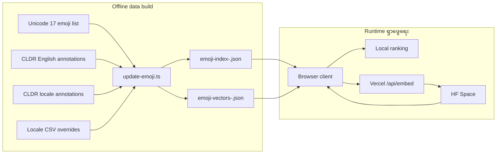
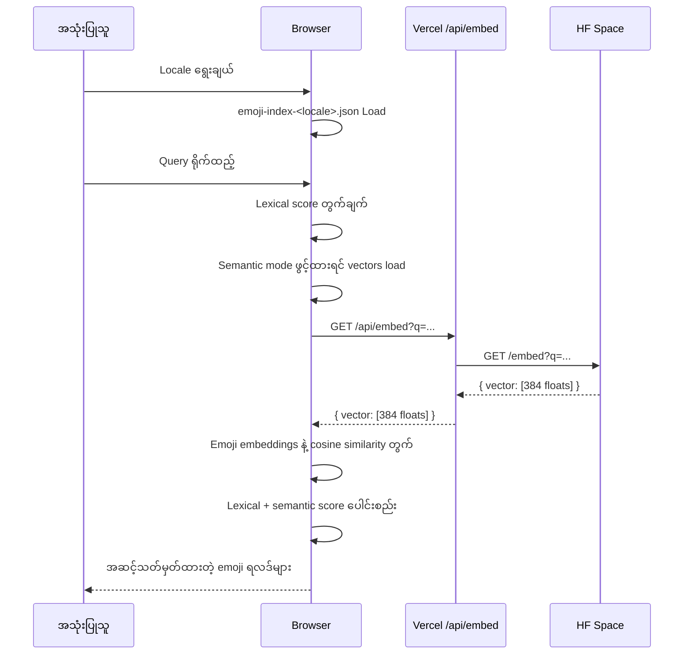

# မြန်မာ Emoji ရှာဖွေရေး Architecture

> 📖 [Read in English](./search-architecture.md)

ဒီစာရွက်စာတမ်းက project မှာ locale-aware emoji data ဘယ်လိုပြင်ဆင်ထားတယ်၊ embeddings ဘယ်လိုဖန်တီးတယ်၊ runtime မှာ ရှာဖွေရေးကို ဘယ်လို လုပ်ဆောင်တယ်ဆိုတာ ရှင်းပြထားပါတယ်။

## အဆင့်မြင့် ဒီဇိုင်း

System က လမ်းကြောင်း ၂ ခု ခွဲထားပါတယ်:

- **Offline ပြင်ဆင်ခြင်း**: locale တစ်ခုချင်းအတွက် emoji dataset တည်ဆောက်ပြီး ဖွင့်ထားတဲ့ locale တွေအတွက် embeddings ကြိုတင်တွက်ချက်ခြင်း
- **Runtime ရှာဖွေရေး**: ရွေးထားတဲ့ locale dataset ကို browser ထဲ load လုပ်ပြီး locally rank ပေးခြင်း၊ semantic signal တွေ ထည့်သွင်းခြင်း (optional)



## ၁. Data ပြင်ဆင်ခြင်း

[data/scripts/update-emoji.ts](../data/scripts/update-emoji.ts) build script က locale တစ်ခုချင်းအတွက် runtime dataset တစ်ခု ဖန်တီးပါတယ်။

### Input များ

- Unicode emoji တရားဝင် သတ်မှတ်ချက်များ
- CLDR English annotation data
- Support ပေးထားတဲ့ locale တွေအတွက် CLDR locale-specific annotation data
- Locale-specific contributor keyword files (ဥပမာ: [data/locales/my-extra-keywords.csv](../data/locales/my-extra-keywords.csv))

### လက်ရှိ Support ပေးထားတဲ့ Locale များ

| Locale | Code | ရှာဖွေရေးနည်းလမ်း |
|---|---|---|
| မြန်မာ | `my` | Burmese-specific lexical + semantic |
| ရှမ်း | `shn` | Generic lexical |
| English | `en` | Generic lexical |

### Build Flow

1. Unicode emoji metadata ယူပြီး fully-qualified emoji entry တွေကို ထိန်းထားပါတယ်
2. CLDR English annotations ယူပြီး derived annotations တွေ merge လုပ်ပါတယ်
3. Support ပေးထားတဲ့ locale တစ်ခုချင်းအတွက် CLDR annotations ယူပြီး merge လုပ်ပါတယ်
4. `data/locales/<locale>-extra-keywords.csv` ကနေ locale-specific contributor keywords merge လုပ်ပါတယ်
5. Locale တစ်ခုချင်းအတွက် lexical dataset တည်ဆောက်ပါတယ်:
   - English name, group, subgroup
   - English CLDR keywords
   - ဒေသခံ name နဲ့ keywords
   - ဒေသခံ contributor keywords
6. မြန်မာအတွက်သာ oppaWord-inspired lexicon တည်ဆောက်ပြီး `wordTokens` ဖန်တီးပါတယ်
7. Semantic mode ဖွင့်ထားတဲ့ locale တွေအတွက်သာ embeddings တည်ဆောက်ပါတယ်
8. Embedding input hash မပြောင်းရင် ရှိပြီးသား embeddings ပြန်သုံးပါတယ်
9. `emoji-index-<locale>.json`, `emoji-vectors-<locale>.json` (optional), `emoji-build-manifest.json` တို့ သိမ်းပါတယ်

#### ဥပမာ: emoji entry တစ်ခုရဲ့ data build

```
Input:
  emoji: 😊
  Unicode name: "smiling face with smiling eyes"
  CLDR English keywords: ["blush", "smile", "eye"]
  CLDR Burmese name: "အပြုံးမျက်နှာ"
  CLDR Burmese keywords: ["ပြုံး", "မျက်နှာ"]
  Contributor keywords (my-extra-keywords.csv): ["ပျော်ရွှင်", "ချစ်စရာ"]

Output (emoji-index-my.json entry):
  enName: "smiling face with smiling eyes"
  englishKeywords: ["blush", "smile", "eye"]
  localizedName: "အပြုံးမျက်နှာ"
  localizedKeywords: ["ပြုံး", "မျက်နှာ"]
  contributorKeywords: ["ပျော်ရွှင်", "ချစ်စရာ"]
  wordTokens: ["အပြုံးမျက်နှာ", "ပြုံး", "မျက်နှာ", "ပျော်ရွှင်", "ချစ်စရာ"]
  group: "Smileys & Emotion"
  subgroup: "face-smiling"
```

### Output files

- `public/data/emoji/emoji-index-my.json` — မြန်မာ lexical data
- `public/data/emoji/emoji-index-shn.json` — ရှမ်း lexical data
- `public/data/emoji/emoji-index-en.json` — English lexical data
- `public/data/emoji/emoji-vectors-my.json` — မြန်မာ semantic vectors
- `public/data/emoji/emoji-build-manifest.json` — build manifest (shared)

## ၂. Client Runtime ရှာဖွေရေး

Browser က ရွေးထားတဲ့ locale ရဲ့ lexical index ကို load လုပ်ပြီး lexical scoring ကို locally လုပ်ပါတယ်။ Semantic mode ဖွင့်ထားတဲ့ locale ဆိုရင် vector index ကိုလည်း lazily fetch လုပ်ပြီး semantic score တွေကို ranking ထဲ merge လုပ်ပါတယ်။

Runtime logic အဓိက ရှိတဲ့ file များ:

- [hooks/use-semantic-search.ts](../hooks/use-semantic-search.ts) — search hook
- [lib/emoji-data.ts](../lib/emoji-data.ts) — data loading & caching
- [lib/search-ranking.ts](../lib/search-ranking.ts) — ranking logic
- [lib/locale-config.ts](../lib/locale-config.ts) — locale registry

### Client Search Flow



#### ဥပမာ: query "ပြုံး" အတွက် runtime flow

```
1. User "ပြုံး" ရိုက်ထည့်
2. Browser: lexical scoring စစ်ဆေး
   → "ပြုံး" keyword ကိုက်ညီတဲ့ emoji တွေ ရှာ
   → 😊 (wordTokens: ["ပြုံး"]) ✅ ကိုက်ညီ
   → 😁 (wordTokens: ["ပြုံး"]) ✅ ကိုက်ညီ
   → 🏠 (wordTokens: ["အိမ်"]) ❌ မကိုက်ညီ
3. Semantic mode (my) ဖွင့်ထားရင်:
   → /api/embed?q=ပြုံး → [0.12, -0.34, ...] 384d vector
   → emoji-vectors-my.json load
   → cosine similarity တွက် → semantic boost ထည့်
4. ရလဒ်: 😊, 😁, 😄 ... (score အမြင့်ဆုံးကနေ)
```

## ၃. Locale Model

[lib/locale-config.ts](../lib/locale-config.ts) ထဲက locale registry က ဒီအချက်တွေအတွက် single source of truth ဖြစ်ပါတယ်:

- Support ပေးထားတဲ့ locale IDs
- Display labels
- CLDR source locale code
- ISO metadata
- Placeholder text နဲ့ example chips
- Search strategy
- Semantic availability

Support ပေးထားတဲ့ locale တွေသာ runtime selector ထဲ ပေါ်ပါတယ်။ Emoji annotation data မရှိသေးတဲ့ planned locale တွေက documentation ထဲသာ ရှိပါတယ်။

#### ဥပမာ: locale config entry

```
{
  id: "my",
  label: "မြန်မာ",
  cldrLocale: "my",
  searchStrategy: "burmese",
  semanticEnabled: true,
  placeholder: "emoji ရှာမယ်...",
  examples: ["ပျော်ရွှင်", "နှလုံးသား", "ကြောင်"]
}
```

## ၄. Lexical ရှာဖွေရေး

Lexical ranking က browser ထဲမှာ အမြဲ run ပါတယ်။

### မြန်မာ

မြန်မာက locale-specific lexical path ကို သုံးပါတယ်:

- Myanmar text compaction
- oppaWord-inspired segmentation
- `wordTokens` matching
- Contributor keyword boosts
- English fallback keywords

#### ဥပမာ: မြန်မာ lexical ရှာဖွေရေး

```
Query: "နှလုံးသား"
↓ Myanmar text compaction
↓ oppaWord segmentation → ["နှလုံးသား"]
↓ wordTokens matching:
  ❤️ wordTokens: ["နှလုံးသား"] → ✅ ကိုက်ညီ (score မြင့်)
  💔 wordTokens: ["နှလုံးသား", "ကွဲ"] → ✅ ကိုက်ညီ
  😊 wordTokens: ["ပြုံး"] → ❌ မကိုက်ညီ
```

### ရှမ်း နှင့် English

ရှမ်းနဲ့ English က generic locale path ကို သုံးပါတယ်:

- Localized name exact match
- Localized keyword phrase match
- Token overlap against localized keywords
- Contributor keyword support
- English keyword support (dataset ထဲမှာ merge ထားပြီးသား)

ဒီလိုလုပ်ခြင်းအားဖြင့် locale တိုင်း သဘာဝကျကျ ရှာနိုင်ပြီး မြန်မာက locale-specific analyzer အဆင့်မြင့်ဆုံး ဖြစ်နေပါတယ်။

## ၅. Semantic ရှာဖွေရေး

Semantic search က လက်ရှိ မြန်မာအတွက်သာ run ပါတယ်။

Semantic mode ဖွင့်ထားတဲ့အခါ:

1. Client က မူရင်း Burmese query နဲ့ segmented query ကနေ query views တည်ဆောက်ပါတယ်
2. အဲ့ query views တွေကို `/api/embed` ကို ပို့ပါတယ်
3. [app/api/embed/route.ts](../app/api/embed/route.ts) က request ကို Hugging Face Space ကို forward လုပ်ပါတယ်
4. [hf-space-embed-service/server.mjs](../hf-space-embed-service/server.mjs) Space service က `intfloat/multilingual-e5-small` model ကို load လုပ်ပြီး `query:` prefix နဲ့ query ပို့ကာ 384-dimensional vector ပြန်ပေးပါတယ်
5. Client က `emoji-vectors-my.json` ကို lazily fetch လုပ်ပါတယ်
6. Query-view vector တစ်ခုချင်းကို emoji embedding တစ်ခုချင်းနဲ့ cosine similarity တွက်ပြီး အအားကောင်းဆုံး weighted signal ကို သုံးပါတယ်
7. Semantic similarity မြင့်တာက lexical evidence ကို boost ပေးပါတယ်၊ အစားထိုးတာ မဟုတ်ပါ

#### ဥပမာ: semantic query views

```
Query: "ပျော်ရွှင်တဲ့မျက်နှာ"
↓ analyzeBurmeseQuery
semanticViews:
  view 1: "ပျော်ရွှင်တဲ့မျက်နှာ" (မူရင်း query)
  view 2: "ပျော်ရွှင် တဲ့ မျက်နှာ" (segmented view)
↓ /api/embed
  view 1 → [0.23, -0.11, ...] 384d vector
  view 2 → [0.19, -0.08, ...] 384d vector
↓ cosine similarity vs emoji embeddings
  😊 similarity: 0.87 (view 1 ကပိုကောင်း)
  😁 similarity: 0.82
↓ semantic boost ← lexical ranking ထဲ ထည့်ပေး
```

ရှမ်းနဲ့ English က lexical mode သာ ရှိပြီး UI မှာ semantic search ကို ပိတ်ထားပါတယ်။

## ၆. လည်ပတ်မှုဆိုင်ရာ မှတ်စုများ

- Browser က locale အလိုက် lexical dataset ကို load ပြီးတာနဲ့ cache လုပ်ပါတယ်
- Semantic-enabled locale တွေအတွက်သာ vector dataset ကို cache လုပ်ပါတယ်
- Offline rebuild တွေက `emoji-build-manifest.json` ကနေ incremental ပုံစံ default ဖြစ်ပါတယ်
- English keywords ကို support ပေးထားတဲ့ locale dataset တိုင်းထဲ merge ထားပါတယ်
- Locale-specific contributor file မရှိတဲ့ locale ကို empty အဖြစ် treat လုပ်ပါတယ်
- Hugging Face Space ကို `EMBEDDING_SERVICE_URL` environment variable နဲ့ ပြောင်းလို့ရပါတယ်

## References

Implement လုပ်ထားတဲ့ sources:

- [oppaWord](https://github.com/ye-kyaw-thu/oppaWord)
- [sylbreak](https://github.com/ye-kyaw-thu/sylbreak)
- [Multilingual E5 model card](https://huggingface.co/intfloat/multilingual-e5-small)
- [Multilingual E5 technical report](https://arxiv.org/abs/2402.05672)

သုံးသပ်ခဲ့ပြီး integrate မလုပ်ရသေးတဲ့ sources:

- [myWord](https://github.com/ye-kyaw-thu/myWord)
- [NgaPi](https://github.com/ye-kyaw-thu/NgaPi)
