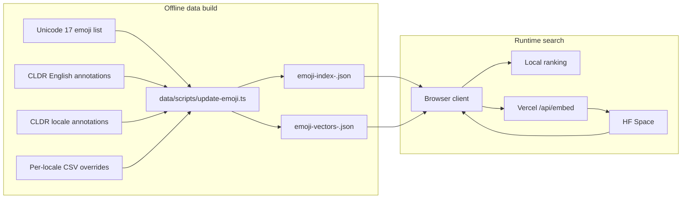
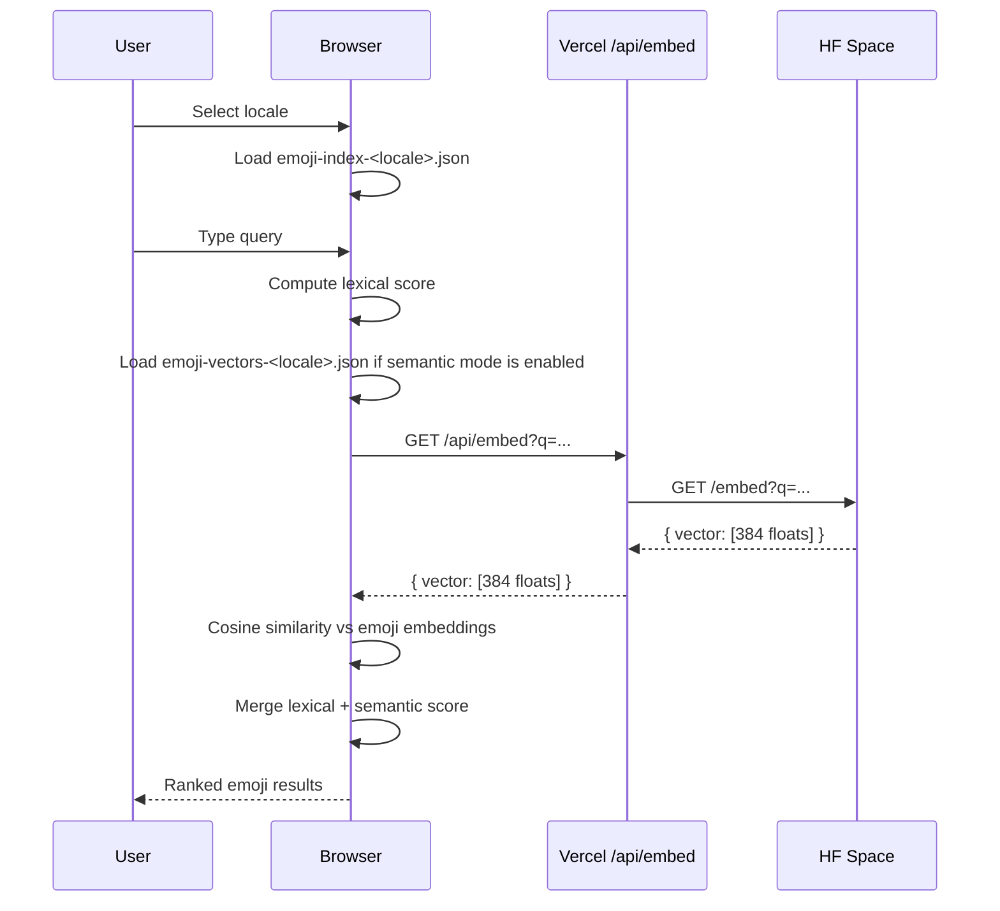

# Myanmar Emoji Search Architecture

This document explains how the project prepares locale-aware emoji data, generates embeddings, and executes search at runtime.

## High-Level Design

The system splits into two paths:

- Offline preparation: build one emoji dataset per supported locale and precompute embeddings where enabled
- Runtime search: load the selected locale dataset in the browser, rank locally, and optionally merge semantic signals

## 1. Data Preparation

The build script in [data/scripts/update-emoji.ts](/Users/heink/v0-burmese-emoji-search-su/data/scripts/update-emoji.ts) generates one runtime dataset per supported locale.

### Inputs

- Official Unicode emoji definitions
- CLDR English annotation data
- CLDR locale-specific annotation data for supported locales
- Locale-specific contributor keyword files such as [data/locales/my-extra-keywords.csv](/Users/heink/v0-burmese-emoji-search-su/data/locales/my-extra-keywords.csv)

### Supported Locales Today

- Burmese (`my`)
- Shan (`shn`)
- English (`en`)

### Build Flow

1. Fetch Unicode emoji metadata and keep fully-qualified emoji entries.
2. Fetch CLDR English annotations and merge any derived annotations.
3. Fetch CLDR annotations for each supported locale and merge any derived annotations.
4. Merge locale-specific contributor keywords from `data/locales/<locale>-extra-keywords.csv`.
5. Build one lexical dataset per locale containing:
   - English name, group, and subgroup
   - English CLDR keywords
   - locale-native name and keywords
   - locale-specific contributor keywords
6. For Burmese only, build an oppaWord-inspired lexicon and generate `wordTokens`.
7. Build embeddings only for locales whose semantic mode is enabled.
8. Reuse existing embeddings when the embedding input hash is unchanged.
9. Save locale outputs to `emoji-index-<locale>.json`, optional `emoji-vectors-<locale>.json`, and the shared `emoji-build-manifest.json`.

### Output

- [public/data/emoji/emoji-index-my.json](/Users/heink/v0-burmese-emoji-search-su/public/data/emoji/emoji-index-my.json)
- [public/data/emoji/emoji-index-shn.json](/Users/heink/v0-burmese-emoji-search-su/public/data/emoji/emoji-index-shn.json)
- [public/data/emoji/emoji-index-en.json](/Users/heink/v0-burmese-emoji-search-su/public/data/emoji/emoji-index-en.json)
- [public/data/emoji/emoji-vectors-my.json](/Users/heink/v0-burmese-emoji-search-su/public/data/emoji/emoji-vectors-my.json)
- [public/data/emoji/emoji-build-manifest.json](/Users/heink/v0-burmese-emoji-search-su/public/data/emoji/emoji-build-manifest.json)

## 2. Client Runtime Search

The browser loads the lexical index for the selected locale and performs lexical scoring locally. If semantic mode is enabled for that locale, it lazily fetches the matching vector index and merges semantic scores into the final ranking.

The runtime logic lives mainly in:

- [hooks/use-semantic-search.ts](/Users/heink/v0-burmese-emoji-search-su/hooks/use-semantic-search.ts)
- [lib/emoji-data.ts](/Users/heink/v0-burmese-emoji-search-su/lib/emoji-data.ts)
- [lib/search-ranking.ts](/Users/heink/v0-burmese-emoji-search-su/lib/search-ranking.ts)
- [lib/locale-config.ts](/Users/heink/v0-burmese-emoji-search-su/lib/locale-config.ts)

### Client Search Flow

## 3. Locale Model

The locale registry in [lib/locale-config.ts](/Users/heink/v0-burmese-emoji-search-su/lib/locale-config.ts) is the single source of truth for:

- supported locale IDs
- display labels
- CLDR source locale code
- ISO metadata
- placeholder text and example chips
- search strategy
- semantic availability

Only supported locales appear in the runtime selector. Planned locales without ready emoji annotation data remain documentation-only.

## 4. Lexical Search

Lexical ranking always runs in the browser.

### Burmese

Burmese uses a locale-specific lexical path:

- Myanmar text compaction
- oppaWord-inspired segmentation
- `wordTokens`
- contributor keyword boosts
- English fallback keywords

### Shan and English

Shan and English use the generic locale path:

- exact localized-name match
- localized keyword phrase match
- token overlap against localized keywords
- contributor keyword support
- English keyword support merged into the same dataset

This lets every supported locale search naturally while keeping Burmese as the most advanced locale-specific analyzer.

## 5. Semantic Search

Semantic search currently runs only for Burmese.

When semantic mode is enabled:

1. The client builds Burmese query views from the original query plus the segmented query.
2. The client sends those query views to `/api/embed`.
3. [app/api/embed/route.ts](/Users/heink/v0-burmese-emoji-search-su/app/api/embed/route.ts) forwards the request to the Hugging Face Space.
4. The Space service in [hf-space-embed-service/server.mjs](/Users/heink/v0-burmese-emoji-search-su/hf-space-embed-service/server.mjs) loads `intfloat/multilingual-e5-small`, sends the query with the `query:` prefix, and returns a 384-dimensional vector.
5. The client lazily fetches `emoji-vectors-my.json`.
6. The client compares each query-view vector with each emoji embedding using cosine similarity and uses the strongest weighted signal.
7. High semantic similarity boosts lexical evidence instead of replacing it.

Shan and English currently expose lexical mode only, and the UI disables semantic search for those locales.

## 6. Operational Notes

- The browser caches lexical datasets by locale after load.
- The browser caches vector datasets by locale and only for semantic-enabled locales.
- Offline rebuilds are incremental by default through `emoji-build-manifest.json`.
- English keywords are merged into every supported locale dataset.
- Locale-specific contributor files are optional; missing files are treated as empty.
- The Hugging Face Space can be changed later with `EMBEDDING_SERVICE_URL`.

## References

Implemented sources:

- [oppaWord](https://github.com/ye-kyaw-thu/oppaWord)
- [sylbreak](https://github.com/ye-kyaw-thu/sylbreak)
- [Multilingual E5 model card](https://huggingface.co/intfloat/multilingual-e5-small)
- [Multilingual E5 technical report](https://arxiv.org/abs/2402.05672)

Reviewed but not integrated:

- [myWord](https://github.com/ye-kyaw-thu/myWord)
- [NgaPi](https://github.com/ye-kyaw-thu/NgaPi)
