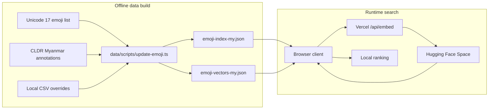
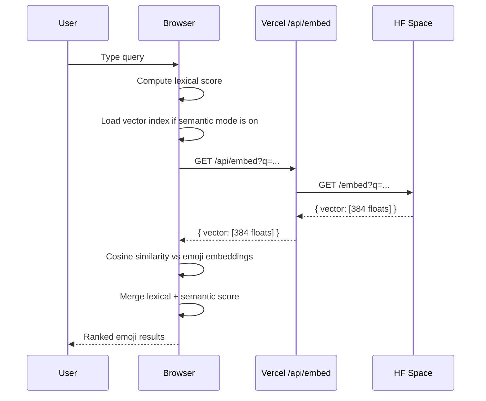

# Burmese Emoji Search Architecture

This document explains how the project prepares emoji data, generates embeddings, and executes search at runtime.

## High-Level Design

The system splits into two paths:

- Offline preparation: build the emoji dataset and precompute emoji embeddings
- Runtime search: keep lexical search local, then lazy-load vectors for semantic reranking when needed

## 1. Data Preparation

The build script in [data/scripts/update-emoji.ts](/Users/heink/v0-burmese-emoji-search-su/data/scripts/update-emoji.ts) generates the runtime dataset.

### Inputs

- Official Unicode emoji definitions
- CLDR Burmese annotation data
- Contributed extra keywords from [data/locales/my-extra-keywords.csv](/Users/heink/v0-burmese-emoji-search-su/data/locales/my-extra-keywords.csv)

### Build Flow

1. Fetch Unicode emoji metadata and keep fully-qualified emoji entries.
2. Fetch Myanmar CLDR annotations and merge them with any derived annotations.
3. Merge contributed extra Burmese keywords from `my-extra-keywords.csv` on top of CLDR annotations.
4. Build an oppaWord-inspired Burmese lexicon from emoji names and keywords.
5. Generate Burmese `wordTokens` for each emoji.
6. Build a combined embedding text for each emoji using Burmese name, Burmese tokens, English name, keywords, group, and subgroup.
7. Run that text through `intfloat/multilingual-e5-small` using Transformers.js with the `passage:` prefix expected by E5 models.
8. Reuse any previous embedding whose hashed input text is unchanged, and only regenerate the rows whose embedding input changed.
9. Save the lexical metadata to `emoji-index-my.json`, the vectors to `emoji-vectors-my.json`, and the reuse manifest to `emoji-build-manifest.json`.

### Output

- [public/data/emoji/emoji-index-my.json](/Users/heink/v0-burmese-emoji-search-su/public/data/emoji/emoji-index-my.json)
- [public/data/emoji/emoji-vectors-my.json](/Users/heink/v0-burmese-emoji-search-su/public/data/emoji/emoji-vectors-my.json)
- [public/data/emoji/emoji-build-manifest.json](/Users/heink/v0-burmese-emoji-search-su/public/data/emoji/emoji-build-manifest.json)
- [public/data/emoji/emoji-index-en.json](/Users/heink/v0-burmese-emoji-search-su/public/data/emoji/emoji-index-en.json)

## 2. Client Runtime Search

The browser loads the lightweight Burmese lexical index and performs lexical scoring locally. If semantic mode is enabled, it lazily fetches the vector index and merges semantic scores into the final ranking.

The runtime logic lives mainly in:

- [hooks/use-semantic-search.ts](/Users/heink/v0-burmese-emoji-search-su/hooks/use-semantic-search.ts)
- [lib/emoji-data.ts](/Users/heink/v0-burmese-emoji-search-su/lib/emoji-data.ts)

### Client Search Flow

## 3. Lexical Search

Lexical ranking is always computed in the browser, even when semantic search is enabled.

### Score Sources

1. Exact match against Burmese name, English name, or keywords
2. Burmese word-token coverage using the app’s oppaWord-inspired segmenter
3. Contributor-keyword boosts for curated Burmese slang and hand-added synonyms
4. English token-aware word overlap for non-Burmese queries

This approach keeps exact matches strong while letting Burmese compound queries benefit from word segmentation and curated keyword coverage instead of falling back to syllable overlap.

## 4. Semantic Search

When semantic mode is enabled:

1. The client builds query views from the original query and the oppaWord-segmented query.
2. The client sends those lowercased query views to `/api/embed`.
3. [app/api/embed/route.ts](/Users/heink/v0-burmese-emoji-search-su/app/api/embed/route.ts) forwards the request to the Hugging Face Space.
4. The Space service in [hf-space-embed-service/server.mjs](/Users/heink/v0-burmese-emoji-search-su/hf-space-embed-service/server.mjs) loads `intfloat/multilingual-e5-small`, sends the query with the `query:` prefix, and returns a 384-dimensional vector.
5. The client lazily fetches `emoji-vectors-my.json` the first time semantic mode is enabled.
6. The client compares each query-view vector with each emoji embedding using cosine similarity and takes the strongest weighted signal.
7. High semantic similarity boosts lexical evidence instead of replacing it, which helps reduce off-topic matches.

This design avoids shipping a heavy transformer runtime to mobile browsers and avoids running large native dependencies inside Vercel serverless functions.

## 5. Why the Current Architecture

The project originally explored local inference inside the browser and then local inference inside Vercel. The current architecture uses a Hugging Face Space because:

- Browser-local inference was too heavy for some devices
- Native ONNX runtimes pushed Vercel functions toward platform size limits
- The app only needs one query embedding per search, so a small remote service is enough
- Ranking remains local, which keeps the UX fast once the vector comes back

## 6. Operational Notes

- The browser caches the lightweight lexical dataset after load.
- The browser caches the vector dataset separately and only after semantic mode is enabled.
- Offline rebuilds are incremental by default and reuse unchanged embeddings via `emoji-build-manifest.json`.
- Semantic mode adds network latency only for the query embedding step, even though it may embed multiple query views.
- The Hugging Face Space can be swapped later by changing `EMBEDDING_SERVICE_URL`.
- If the Space becomes private, `/api/embed` can forward a bearer token through `EMBEDDING_SERVICE_TOKEN`.

## References

Implemented sources:

- [oppaWord](https://github.com/ye-kyaw-thu/oppaWord)
- [sylbreak](https://github.com/ye-kyaw-thu/sylbreak)
- [Multilingual E5 model card](https://huggingface.co/intfloat/multilingual-e5-small)
- [Multilingual E5 technical report](https://arxiv.org/abs/2402.05672)

Reviewed but not integrated:

- [myWord](https://github.com/ye-kyaw-thu/myWord)
- [NgaPi](https://github.com/ye-kyaw-thu/NgaPi)
