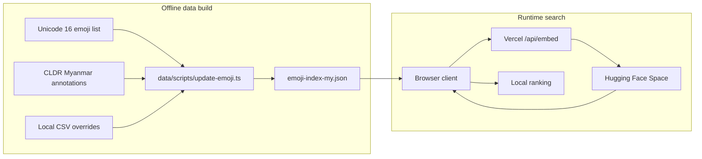
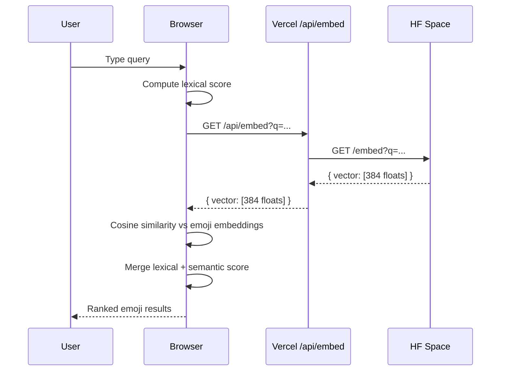

# Burmese Emoji Search Architecture

This document explains how the project prepares emoji data, generates embeddings, and executes search at runtime.

## High-Level Design

The system splits into two paths:

- Offline preparation: build the emoji dataset and precompute emoji embeddings
- Runtime search: generate one query embedding remotely, then score everything locally in the browser

## 1. Data Preparation

The build script in [data/scripts/update-emoji.ts](/Users/heink/v0-burmese-emoji-search-su/data/scripts/update-emoji.ts) generates the runtime dataset.

### Inputs

- Official Unicode emoji definitions
- CLDR Burmese annotation data
- Manual overrides from [data/locales/my.csv](/Users/heink/v0-burmese-emoji-search-su/data/locales/my.csv)

### Build Flow

1. Fetch Unicode emoji metadata and keep fully-qualified emoji entries.
2. Fetch Myanmar CLDR annotations and merge them with any derived annotations.
3. Merge local CSV overrides so project-specific Burmese names and keywords win when needed.
4. Build a combined text string for each emoji using Burmese name, English name, and keywords.
5. Run that text through `intfloat/multilingual-e5-small` using Transformers.js with the `passage:` prefix expected by E5 models.
6. Save the 384-dimensional embedding beside the emoji metadata in `emoji-index-my.json`.

### Output

- [public/data/emoji/emoji-index-my.json](/Users/heink/v0-burmese-emoji-search-su/public/data/emoji/emoji-index-my.json)
- [public/data/emoji/emoji-index-en.json](/Users/heink/v0-burmese-emoji-search-su/public/data/emoji/emoji-index-en.json)

## 2. Client Runtime Search

The browser loads the Burmese index and performs the final scoring locally.

The runtime logic lives mainly in:

- [hooks/use-semantic-search.ts](/Users/heink/v0-burmese-emoji-search-su/hooks/use-semantic-search.ts)
- [lib/emoji-data.ts](/Users/heink/v0-burmese-emoji-search-su/lib/emoji-data.ts)

### Client Search Flow

## 3. Lexical Search

Lexical ranking is always computed in the browser, even when semantic search is enabled.

### Score Sources

1. Exact match against Burmese name, English name, or keywords
2. Substring match against those same fields
3. Burmese syllable overlap using `sylbreak`
4. English word overlap for non-Burmese queries

This approach keeps exact matches strong while still being forgiving for Burmese compound words.

## 4. Semantic Search

When semantic mode is enabled:

1. The client sends the lowercased query to `/api/embed`.
2. [app/api/embed/route.ts](/Users/heink/v0-burmese-emoji-search-su/app/api/embed/route.ts) forwards the request to the Hugging Face Space.
3. The Space service in [hf-space-embed-service/server.mjs](/Users/heink/v0-burmese-emoji-search-su/hf-space-embed-service/server.mjs) loads `intfloat/multilingual-e5-small`, sends the query with the `query:` prefix, and returns a 384-dimensional vector.
4. The client compares that vector with each emoji embedding using cosine similarity.
5. High semantic similarity boosts the lexical score instead of replacing it.

This design avoids shipping a heavy transformer runtime to mobile browsers and avoids running large native dependencies inside Vercel serverless functions.

## 5. Why the Current Architecture

The project originally explored local inference inside the browser and then local inference inside Vercel. The current architecture uses a Hugging Face Space because:

- Browser-local inference was too heavy for some devices
- Native ONNX runtimes pushed Vercel functions toward platform size limits
- The app only needs one query embedding per search, so a small remote service is enough
- Ranking remains local, which keeps the UX fast once the vector comes back

## 6. Operational Notes

- The browser caches the large emoji dataset in memory after load.
- Semantic mode adds network latency only for the query embedding step.
- The Hugging Face Space can be swapped later by changing `EMBEDDING_SERVICE_URL`.
- If the Space becomes private, `/api/embed` can forward a bearer token through `EMBEDDING_SERVICE_TOKEN`.
